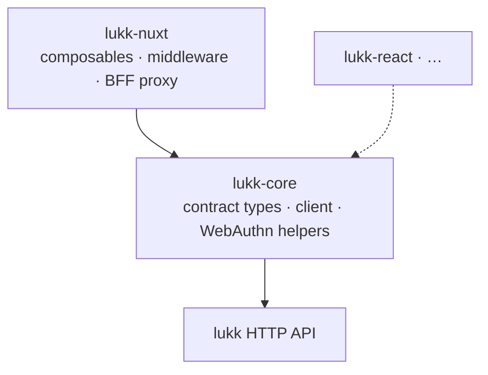

# Architecture

How lukk-js is put together, and why — the design choices that keep it small, swappable, and honest about the server it talks to.

- [Two Layers](#layers)
- [The Hooks Seam](#hooks)
- [One API, Two Transports](#transports)
- [Refresh & Retry](#refresh)
- [Security Posture](#security)
- [Conformance](#conformance)
- [Quality Gate](#quality)
- [Mapping to lukk](#mapping)

## Two Layers

lukk-js is a framework-agnostic core with per-framework bindings on top:

`lukk-core` knows the lukk contract and how to *speak* it. It knows nothing about storage, reactivity, or any framework. `lukk-nuxt` supplies those — Nuxt `useState`, route middleware, a Nitro proxy — by wiring the core's [hooks](#hooks). A future `lukk-react` would do the same with React state, reusing the entire core unchanged.

This is why the core has zero runtime dependencies: it's pure contract plus plumbing.

## The Hooks Seam

`createLukkClient(hooks)` is the seam. The client never decides *where* a token lives or *how* a refresh happens — it asks, through hooks:

- `getAccessToken` / `onTokens` — read and persist the access token.
- `refresh` — produce a fresh pair on demand.
- `getConfirmationToken` — supply the step-up token to auto-attach.

A binding fills these in for its world. In `lukk-nuxt`'s direct mode they read/write SSR-safe `useState`; in BFF mode the Nitro proxy fills the same role server-side. Same core, different seam wiring. See [Using lukk-core](core.md#hooks).

## One API, Two Transports

The composables expose one surface; a config switch chooses the [transport](transport-modes.md) beneath it:

- **`direct`** — the client plugin points the core's `baseURL` at lukk and stores the access token in memory.
- **`bff`** — the client points at the same-origin proxy (`/api/_lukk`), and a Nitro handler captures the tokens into a sealed cookie, refreshing server-side on a 401.

The proxy is the only mode-specific code; the composables don't know which mode they're in. That's what lets you change `mode` without touching a component.

## Refresh & Retry

When a request returns `401`, the client calls `refresh` once and retries the original request with the new token. Concurrent 401s — common under SSR or a burst of parallel requests — are collapsed into a **single in-flight refresh** (`singleFlight`), so a page that fires ten requests at once triggers one refresh, not ten. The **BFF proxy single-flights its server-side refresh per session** for the same reason. Both dovetail with lukk's [grace window](https://github.com/stsepelin/lukk/blob/main/docs/authentication.md#refreshing-tokens), which tolerates concurrent refreshes without treating them as token reuse — so a rotated refresh token is never replayed into a false family revocation.

## Security Posture

- **No token in `localStorage`, ever.** BFF keeps every token (access, refresh, *and* confirmation) server-side in a sealed cookie; direct mode keeps the access token in memory and the refresh token in lukk's `__Host-` cookie.
- **BFF strips credentials from responses.** The proxy replaces a token- or confirmation-bearing body with `{ ok: true }` before it reaches the browser — the browser only ever holds the opaque session cookie.
- **BFF is CSRF-hardened.** The sealed session cookie is `SameSite=Strict; Secure; HttpOnly`, and the proxy rejects any state-changing request with a foreign `Origin`. The proxied subpath is contained to lukk's base URL (no traversal / SSRF).
- **Credentials are origin-scoped.** The client attaches the bearer / confirmation header (and cookies) only to same-origin-as-`baseURL` targets, never to an absolute cross-origin URL.
- **Refresh tokens are opaque** to lukk-js — it never inspects or stores them beyond handing them back to lukk.

The right mode for the strongest posture is BFF; direct mode is for static deploys where no server exists to hold a secret. [Transport Modes](transport-modes.md) lays out the trade-off.

## Conformance

A hand-written TypeScript type is a guess about the server until something checks it. lukk-js checks it: a [conformance harness](https://github.com/stsepelin/lukk-js/tree/main/conformance) boots a **real lukk instance** (a Laravel app installing the actual package) and runs the client's flows against it, in CI, across **both** delivery modes.

It doesn't stop at shapes — it completes the real ceremonies: a genuine TOTP code clears a 2FA challenge, and a software WebAuthn authenticator runs a full passkey **register → passwordless login**. If lukk changes a response and lukk-js doesn't, conformance goes red. That's the guarantee the contract types are worth trusting.

## Quality Gate

Both packages enforce **100% test coverage** (statements, branches, functions, lines) — the same bar lukk holds on the PHP side. Lint and type-checking run in CI alongside the coverage gate and the conformance suite. The Nuxt runtime is unit-tested through a lightweight `#imports` mock, so the tests run without booting Nuxt.

## Mapping to lukk

Every lukk-js concept has a lukk counterpart:

| lukk-js | lukk |
|---|---|
| `direct` mode | `cookie_mode => true` |
| `bff` mode | `cookie_mode => false` (body mode) |
| `useLukkConfirmation` | the `lukk.confirm` step-up middleware |
| `X-Lukk-Confirmation` auto-attach | `confirm.header` |
| single-flight refresh | the rotation grace window |
| `useLukkPasskeys` / `useLukkTwoFactor` | the `passkeys` / `two_factor` features |

When in doubt about behavior, the [lukk docs](https://github.com/stsepelin/lukk/tree/main/docs) are the source of truth — lukk-js is built to match them, and conformance proves it does.
