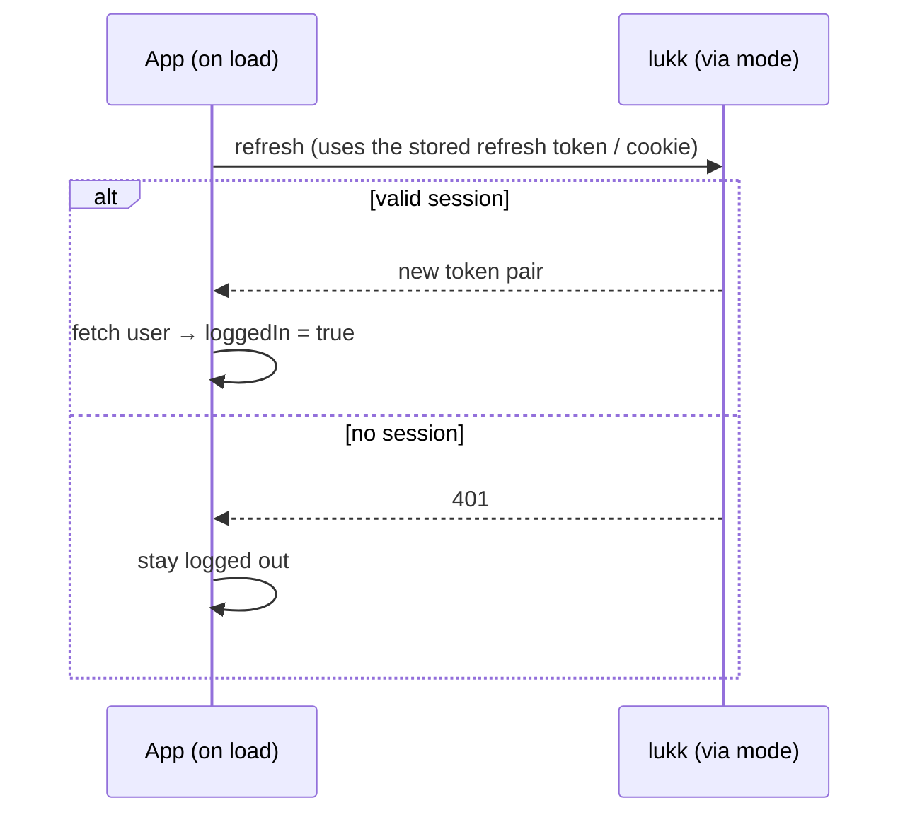

# Authentication

- [`useLukkAuth`](#composable)
- [Logging In](#login)
- [The Current User](#user)
- [Logging Out](#logout)
- [Session Restore](#restore)
- [Revoking Sessions](#sessions)
- [Protecting Routes](#middleware)

<a name="composable"></a>
## `useLukkAuth`

Everything you need for the common case is on one composable, auto-imported in every component, page, and plugin:

```ts
const {
  user,                // Ref<User | null> — the authenticated user
  loggedIn,            // ComputedRef<boolean>
  login,               // (credentials) => Promise<LoginResult>
  logout,              // () => Promise<void>
  fetchUser,           // () => Promise<void> — reload the user
  initSession,         // () => Promise<void> — silent restore (runs automatically)
  revokeOtherSessions, // () => Promise<void>
  // two-factor — see the Two-Factor page:
  pendingTwoFactor,    // ComputedRef<boolean>
  verifyTwoFactor,     // (code) => Promise<void>
  verifyRecoveryCode,  // (recoveryCode) => Promise<void>
} = useLukkAuth()
```

The API is identical in [both transport modes](transport-modes.md) — only what happens under the hood differs.

<a name="login"></a>
## Logging In

Call `login` with the user's credentials:

```vue
<script setup lang="ts">
const { login } = useLukkAuth()

const email = ref('')
const password = ref('')
const error = ref('')

async function onSubmit() {
  error.value = ''
  try {
    await login({ email: email.value, password: password.value })
    await navigateTo('/dashboard')
  }
  catch (e) {
    error.value = (e as { message?: string }).message ?? 'Login failed'
  }
}
</script>
```

On success, the token is persisted and the [user is loaded](#user) — `loggedIn` flips to `true`. A failed login throws a typed [`LukkError`](core.md#errors) (`{ status, message, errors? }`).

> [!NOTE]
> If the user has two-factor authentication enabled, `login` does **not** log them in — it surfaces a challenge (`pendingTwoFactor` becomes `true`) for you to complete. See [Two-Factor Authentication](two-factor-authentication.md).

<a name="user"></a>
## The Current User

`user` is a reactive ref, populated from your [`user.endpoint`](configuration.md#user-endpoint). lukk issues the token; your app owns the user, so lukk-js fetches it from your backend. In **direct** mode the access token is attached as a `Bearer`; in **bff** mode the browser has no token, so `user.endpoint` must be a same-origin path authenticated server-side (the [app-API proxy](transport-modes.md#bff) or your own route via `getLukkAccessToken(event)`):

```vue
<template>
  <p v-if="loggedIn">Signed in as {{ user.email }}</p>
  <LoginForm v-else />
</template>
```

Call `fetchUser()` to reload it (e.g. after a profile update). With no `user.endpoint` configured, `user` stays `null` and you can drive `loggedIn` yourself.

<a name="logout"></a>
## Logging Out

```ts
const { logout } = useLukkAuth()
await logout()
```

This revokes the session on lukk and clears the local state (access token, user, any pending challenge or confirmation) — even if the network call fails, the client is left logged out.

<a name="restore"></a>
## Session Restore

A returning user with a valid refresh token should arrive already logged in. The module registers a client plugin that calls `initSession()` on load, which silently attempts a refresh and, if it succeeds, loads the user:



You don't normally call `initSession()` yourself — the plugin does. It's exposed for tests and custom boot flows.

<a name="sessions"></a>
## Revoking Sessions

`revokeOtherSessions()` ends every session **except** the current one — useful after a password change ("log out my other devices"):

```ts
const { revokeOtherSessions } = useLukkAuth()
await revokeOtherSessions()
```

To end *every* session including the current one, just [log out](#logout).

<a name="middleware"></a>
## Protecting Routes

The module registers two route middlewares:

| Middleware | Effect |
|---|---|
| `lukk-auth` | Redirects to `/login` when **not** authenticated. |
| `lukk-guest` | Redirects to `/` when **already** authenticated (e.g. to keep logged-in users off the login page). |

```vue
<script setup lang="ts">
// pages/dashboard.vue
definePageMeta({ middleware: 'lukk-auth' })
</script>
```

```vue
<script setup lang="ts">
// pages/login.vue
definePageMeta({ middleware: 'lukk-guest' })
</script>
```

Next: **[Transport Modes](transport-modes.md)**.
