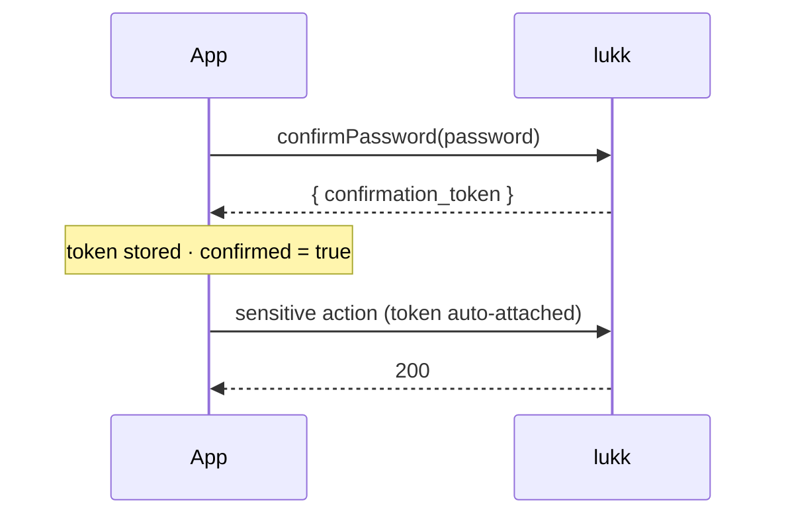

# Confirmation

Some actions are too sensitive to allow on the strength of an old login — changing 2FA, managing passkeys. lukk gates those behind **step-up ("sudo") confirmation**: the user re-proves their identity, and for a short window afterwards the sensitive routes open up. `useLukkConfirmation` is the client for that.

> [!NOTE]
> This is the client for lukk's server-side step-up — see [Confirmation on the lukk side](https://stsepelin.github.io/lukk/confirmation) for the routes and how it gates your own.

- [`useLukkConfirmation`](#composable)
- [How It Works](#how)
- [Confirming with a Password](#password)
- [Confirming with a Passkey](#passkey)
- [Gated Actions](#gated)

<a name="composable"></a>
## `useLukkConfirmation`

```ts
const {
  confirmed,       // ComputedRef<boolean> — is a confirmation currently held?
  token,           // Ref<string | null>
  confirmPassword, // (password) => Promise<void>
  clear,           // () => void
} = useLukkConfirmation()
```

<a name="how"></a>
## How It Works

When you confirm, the token is **automatically attached** in the `X-Lukk-Confirmation` header on every subsequent request — so once `confirmed` is `true`, the gated actions simply work, until the window expires server-side (lukk's [`confirm.ttl`](https://stsepelin.github.io/lukk/confirmation#configuration)). You never thread the token through your own calls.

Where the token lives depends on the [mode](transport-modes.md):

- **`direct`** — the token is stored in client state and the client attaches the header.
- **`bff`** — the proxy strips the token from the response and **holds it server-side**, injecting the header itself. The browser only sees `confirmed` flip to `true`; it never holds the confirmation credential.



You never thread the token through your own calls — earning it is the only step.

<a name="password"></a>
## Confirming with a Password

```ts
const { confirmPassword, confirmed } = useLukkConfirmation()

await confirmPassword(currentPassword)
// confirmed.value === true
```

A wrong password throws a typed [`LukkError`](core.md#errors). Call `clear()` to drop the confirmation early (it also clears on [logout](authentication.md#logout)).

<a name="passkey"></a>
## Confirming with a Passkey

A passkey can satisfy step-up too — see [Passkeys → Step-Up](passkeys.md#confirm):

```ts
const { confirm } = useLukkPasskeys()
await confirm() // stores the confirmation token, same as confirmPassword
```

<a name="gated"></a>
## Gated Actions

These actions require a held confirmation. Without one, lukk responds `423 Locked`:

- [Managing 2FA](two-factor-authentication.md#management) — enable, confirm, disable, regenerate recovery codes
- [Registering or removing a passkey](passkeys.md#manage)

A common pattern is to confirm just before opening a security settings screen:

```ts
const { confirmed, confirmPassword } = useLukkConfirmation()

async function openSecuritySettings(password: string) {
  if (!confirmed.value) await confirmPassword(password)
  await navigateTo('/settings/security')
}
```

Next: **[Using lukk-core](core.md)**.
