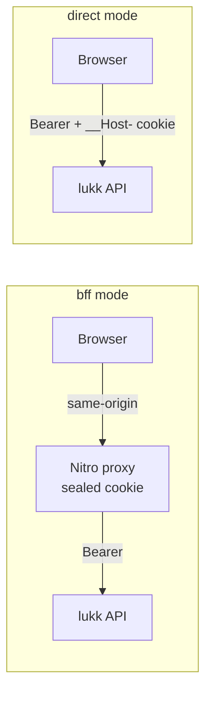

# Introduction

- [What lukk-js Is](#what)
- [The Two Packages](#packages)
- [The Two Modes](#modes)
- [When to Use lukk-js](#when)

## What lukk-js Is

[lukk](https://stsepelin.github.io/lukk/) is a Laravel package that issues short-lived access JWTs and opaque rotating refresh tokens for **first-party** apps — apps where you own both the client and the API. lukk-js is the other half of that story: the client that talks to it.

It does the unglamorous work you'd otherwise hand-write for every project — attaching the bearer token, refreshing it before requests fail, surviving a 401, threading the 2FA and passkey ceremonies, and keeping a reactive `user` in sync — behind one small composable surface.

Crucially, lukk-js mirrors lukk's HTTP contract in TypeScript and [conformance-tests it against a real lukk instance](architecture.md#conformance), so the types you code against can't silently drift from the server.

## The Two Packages

| Package | What it is |
|---|---|
| **`lukk-core`** | Framework-agnostic. The lukk contract **types**, an auth **client** (`createLukkClient`) that attaches tokens and refreshes on a 401 with single-flight, and **WebAuthn helpers** for the passkey ceremonies. No runtime dependencies. |
| **`lukk-nuxt`** | A Nuxt module built on `lukk-core`. Auto-imported composables, route middleware, the BFF proxy, and the transport wiring — Nuxt 3 and 4. |

If you're on Nuxt, install `lukk-nuxt` and never touch `lukk-core` directly. On another framework (or no framework), use `lukk-core` — see [Using lukk-core](core.md).

## The Two Modes

lukk-js speaks to lukk in one of two transport modes. The mode is a single config value; **your component code is identical either way.**

- **`bff`** — a Nitro proxy holds the tokens in a sealed, server-side cookie and forwards requests to lukk. The browser only ever talks to your own origin and never sees a token. Best for SSR or a served SPA.
- **`direct`** — the client calls lukk directly. The access token lives in memory; the refresh token lives in lukk's hardened `__Host-` cookie. The only option for a fully static site (SSG).

See [Transport Modes](transport-modes.md) for the full comparison.

## When to Use lukk-js

Use it when your frontend authenticates against a lukk-powered Laravel API. It is **first-party** by design — there's no third party to delegate to, no OAuth authorization-code dance, no PKCE.

If you need third-party sign-in (users authenticating *your* app against *someone else's* identity provider), that's an OAuth/OIDC problem and lukk-js is not the tool.

Next: **[Installation](installation.md)**.
