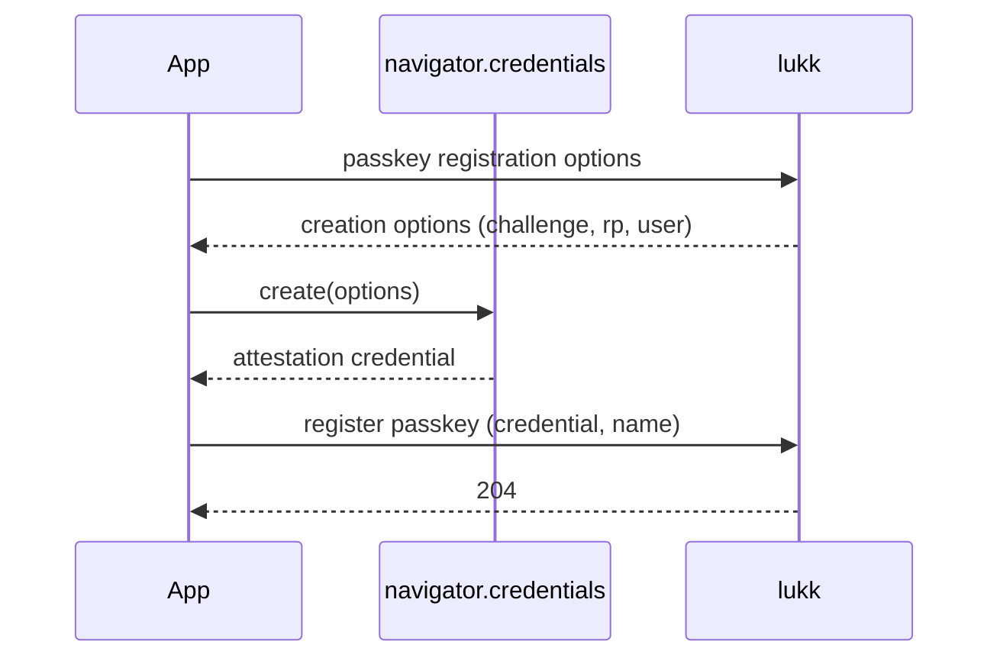

# Passkeys

Passkeys are passwordless, phishing-resistant WebAuthn/FIDO2 credentials. `useLukkPasskeys` drives the browser ceremony (`navigator.credentials`) and the base64url (de)serialization for you — you just `await` a verb.

> [!NOTE]
> Passkeys must be enabled on the [lukk](https://stsepelin.github.io/lukk/passkeys) side (`features.passkeys`, plus an `rp_id` and `origins`). WebAuthn requires a secure context (HTTPS, or `localhost`).

> [!IMPORTANT]
> Passkeys are phishing-resistant only because the authenticator binds each assertion to the **browser-facing origin**. Set lukk's `rp_id` to your app's registrable domain and `origins` to the exact origin in the address bar — **not** the lukk API host. In BFF mode the browser talks to your app, so the RP is your app's origin, even though the API lives elsewhere. Avoid wildcard origins. See lukk's [split-domain deployments](https://stsepelin.github.io/lukk/passkeys#split-domain-deployments) for setting `rp_id`/`origins` on the server.

- [`useLukkPasskeys`](#composable)
- [Registering a Passkey](#register)
- [Passwordless Login](#login)
- [Managing Passkeys](#manage)
- [Step-Up with a Passkey](#confirm)

<a name="composable"></a>
## `useLukkPasskeys`

```ts
const {
  register, // (name?) => Promise<void>
  login,    // () => Promise<void>   — passwordless, then loads the user
  confirm,  // () => Promise<void>   — step-up via passkey
  list,     // () => Promise<{ passkeys: PasskeySummary[] }>
  remove,   // (credentialId) => Promise<void>
} = useLukkPasskeys()
```

<a name="register"></a>
## Registering a Passkey

Registration is a sensitive action, so it sits behind [step-up confirmation](confirmation.md). Confirm first, then register:



```ts
const { confirmPassword } = useLukkConfirmation()
const { register } = useLukkPasskeys()

await confirmPassword(currentPassword) // step up
await register('My MacBook')           // name is optional
```

The browser prompts the user to create the passkey; `register` handles the options, the ceremony, and posting the result to lukk.

<a name="login"></a>
## Passwordless Login

`login()` runs the assertion ceremony and, on success, persists the tokens and loads the user — no email or password:

```vue
<script setup lang="ts">
const { login } = useLukkPasskeys()

async function signInWithPasskey() {
  await login()
  await navigateTo('/dashboard')
}
</script>
```

A user can register a passkey on one device and sign in with it on another (synced passkeys "just work" — lukk never flags a zero sign-count).

<a name="manage"></a>
## Managing Passkeys

List the user's passkeys for a settings screen, and remove one by its credential id:

```ts
const { list, remove } = useLukkPasskeys()

const { passkeys } = await list()
// passkeys: { id, name, last_used_at }[] — never the key material

await remove(passkeys[0].id)
```

> [!NOTE]
> Removing a passkey is a sensitive action and is gated behind [confirmation](confirmation.md) on the lukk side.

<a name="confirm"></a>
## Step-Up with a Passkey

A user can also satisfy [step-up confirmation](confirmation.md) with a passkey instead of their password — convenient, and phishing-resistant:

```ts
const { confirm } = useLukkPasskeys()
await confirm() // runs an assertion → stores a confirmation token
```

After `confirm()`, the next sensitive action (managing 2FA, registering another passkey) is authorized, exactly as if they'd re-entered their password. See [Confirmation](confirmation.md).

Next: **[Confirmation](confirmation.md)**.
