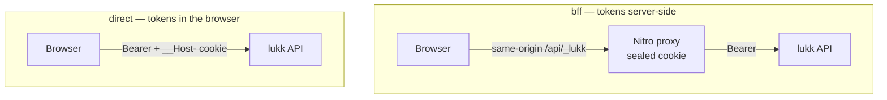
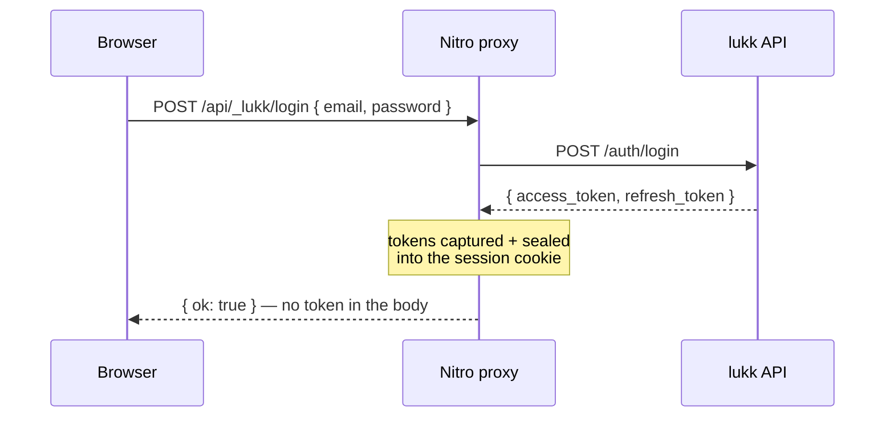

# Transport Modes

- [The Choice](#choice)
- [BFF Mode](#bff)
- [Direct Mode](#direct)
- [Which Mode for Which App](#matrix)
- [Switching Modes](#switching)

<a name="choice"></a>
## The Choice

lukk-js reaches lukk in one of two ways. They differ only in **where the tokens live and who talks to lukk** — your component code is identical either way, because both sit behind the same composables.



<a name="bff"></a>
## BFF Mode

`mode: 'bff'` (the default). A Nitro server route (`/api/_lukk/**`) proxies every auth call to lukk. The tokens are captured on the server and stored in a **sealed, encrypted cookie** — the browser receives only that opaque session cookie and **never sees a JWT or a refresh token**.



The proxy also refreshes server-side: when a forwarded request comes back `401`, it uses the stored refresh token to mint a new pair, re-seals it, and retries — all without the browser noticing.

The proxy also **holds the step-up confirmation token server-side** (it strips it from confirm responses and injects the `X-Lukk-Confirmation` header itself) — so in BFF mode *no* credential, not even the confirmation token, ever reaches the browser.

**Why choose it**

- The browser holds **no token** (access, refresh, or confirmation), so XSS can't exfiltrate one.
- Clean SSR: the server already has the session, so authenticated pages render on the first paint.
- No CORS — the browser only talks to your own origin.

**The CSRF trade-off.** Moving tokens server-side trades XSS-exfiltration risk for CSRF risk: the proxy is authenticated by the ambient session cookie. lukk-nuxt closes this — the session cookie is `__Host-lukk-session` (`SameSite=Strict; Secure; HttpOnly; Path=/`, no `Domain`), **and** the proxy rejects any state-changing request whose `Origin` doesn't match your app (a `403`). You don't need to add your own CSRF layer for `/api/_lukk/**`.

**What it needs**

- A runtime server (Node, an edge runtime, a serverless function) — so it does **not** work for a fully static (SSG) deploy.
- A session secret, [`NUXT_LUKK_SESSION_PASSWORD`](configuration.md#session-password).
- lukk in body mode (`LUKK_COOKIE_MODE=false`, its default), so the proxy receives the refresh token to seal.

> [!NOTE]
> **Throttling & `grace_seconds`.** Every user's auth traffic egresses from the BFF server's IP, so lukk's *per-IP* refresh/login throttles collapse onto one address — raise them for a BFF deployment (and forward `X-Forwarded-For` to lukk if it sits behind your proxy). Keep lukk's `grace_seconds > 0` (its default 30s): the proxy single-flights refresh, but a zero grace window turns any concurrent refresh into a full-family revocation.

### Authenticating your own API in BFF

The proxy above authenticates the lukk **`/auth`** routes. Your **own** API (and
`user.endpoint`) gets no token automatically — the browser has none. Two supported ways:

1. **The app-API proxy** (recommended) — forward `${path}/**` to a fixed Laravel `target`,
   injecting the bearer server-side:

   ```ts
   lukk: {
     mode: 'bff',
     api: { path: '/api', target: 'https://api.example.com' },
     user: { endpoint: '/api/me' }, // same-origin → authenticated by the proxy
   }
   ```

   `$fetch('/api/...')` from the browser is now authenticated, the token never leaving the
   server. SSRF-safe (fixed target), CSRF-checked, strips the inbound cookie/authorization
   **and any browser-spoofable `X-Forwarded-*` headers** (stamping a trusted client IP so
   Laravel's per-IP throttling/logging can't be poisoned), strips upstream `Set-Cookie`,
   marks responses non-cacheable, streams the body, and never proxies `/api/_lukk/**`.

   > [!NOTE]
   > The trusted IP is the connection peer. If Nitro itself sits behind a load balancer /
   > CDN, that's the LB's IP — configure your trust chain (or have your edge set the real
   > `X-Forwarded-For`) if Laravel needs the true client IP.

2. **Your own server route** — read the token with the auto-imported read-only helper
   `getLukkAccessToken(event)` (it never sets a cookie, so it's safe on unauthenticated
   requests):

   ```ts
   export default defineEventHandler(async (event) => {
     const token = await getLukkAccessToken(event)
     if (!token) throw createError({ statusCode: 401 })
     return $fetch('https://api.example.com/me', { headers: { Authorization: `Bearer ${token}` } })
   })
   ```

> [!NOTE]
> Make your Laravel API return JSON `401`s for `api/*` (send `Accept: application/json` /
> configure exception rendering) — otherwise its default `unauthenticated()` redirect to a
> `login` route surfaces a confusing 500 through the proxy. The BFF proxy itself is mounted
> at the exported `LUKK_BFF_PREFIX` (`/api/_lukk`); keep your routes clear of it.

<a name="direct"></a>
## Direct Mode

`mode: 'direct'`. The client in the browser calls lukk directly — there is no proxy. The access token is kept **in memory** (never in `localStorage`), and the refresh token lives in lukk's hardened `__Host-refresh` cookie (HttpOnly, Secure, `SameSite=Strict`), which the browser sends automatically on refresh.

**Why choose it**

- No runtime server required — it works for a **fully static site** served from a CDN.
- Simpler deploy: there's nothing server-side to run.

**What it needs**

- lukk in cookie mode (`LUKK_COOKIE_MODE=true`), so the refresh token is delivered as the `__Host-` cookie.
- **CORS configured on lukk** for your site's exact origin, with credentials. Because the client sends `credentials: 'include'`, lukk must echo your specific `Origin` and set `Access-Control-Allow-Credentials: true` — a wildcard `Access-Control-Allow-Origin: *` is rejected by the browser when credentials are included. Getting this wrong fails *silently* as a perpetual logged-out loop. (Cross-site cookie delivery also requires lukk's refresh cookie to be `SameSite=None; Secure` if your app and API are on different sites.)

> [!WARNING]
> **The access token is reachable by JavaScript in direct mode.** It lives in client memory (never `localStorage`), but any script on the page — including injected script under XSS — can read it and call the API as the user until it expires. Minimise your XSS surface and set a strict Content-Security-Policy. The token is **not** written during SSR, so it never lands in the hydration payload; keep it that way (don't trigger `login`/`fetchUser` server-side). If you need the browser to hold *no* token at all, use **BFF mode**.

> [!NOTE]
> The access token in memory is gone on a full page reload — that's fine. On load, [session restore](authentication.md#restore) silently refreshes from the `__Host-` cookie and you're logged back in.

<a name="matrix"></a>
## Which Mode for Which App

| Your app | Recommended mode |
|---|---|
| SSR (Nuxt with a Node/edge server) | **`bff`** |
| SPA served by a Node server | **`bff`** |
| Static site / SSG (CDN, no server) | **`direct`** |
| Prototype hitting a local lukk | either |

When in doubt and you have a server, prefer **`bff`** — keeping tokens out of the browser is the stronger default.

<a name="switching"></a>
## Switching Modes

Flip one config value — and update the lukk side to match the delivery mode:

```ts
// nuxt.config.ts
lukk: { mode: 'direct' }
```

```dotenv
# lukk (.env) — cookie mode for direct, body mode for bff
LUKK_COOKIE_MODE=true
```

No component, composable, or page changes. That's the point.

Next: **[Two-Factor Authentication](two-factor-authentication.md)**.
