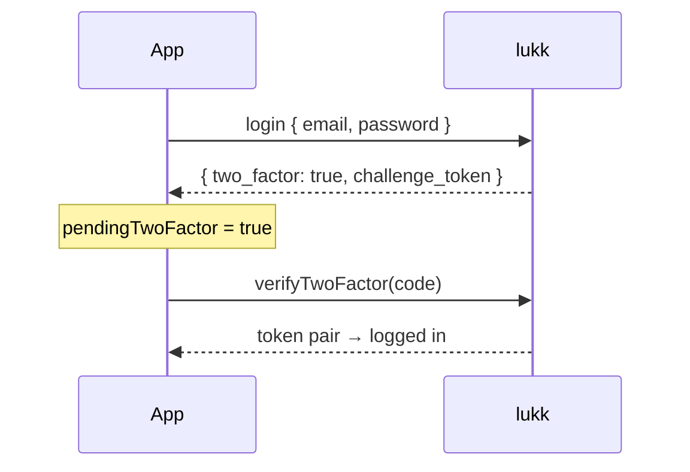

# Two-Factor Authentication

Two-factor authentication has two halves: **completing a login** when a user has 2FA enabled, and **managing** 2FA (turning it on, off, recovery codes). The first lives on `useLukkAuth`; the second on `useLukkTwoFactor`.

> [!NOTE]
> 2FA must be enabled and configured on the [lukk](https://github.com/stsepelin/lukk) side (`features.two_factor`). lukk-js is the client for it.

- [The Login Challenge](#challenge)
- [Recovery Codes at Login](#recovery)
- [Managing 2FA](#management)
- [Enrolment](#enrolment)

<a name="challenge"></a>
## The Login Challenge

When a 2FA user logs in, lukk returns a **challenge** instead of tokens. `login` surfaces this by flipping `pendingTwoFactor` to `true` rather than completing — you show a code input and call `verifyTwoFactor`:



```vue
<script setup lang="ts">
const { login, pendingTwoFactor, verifyTwoFactor } = useLukkAuth()

const code = ref('')

async function onLogin() {
  await login({ email: email.value, password: password.value })
  // if pendingTwoFactor is now true, the template shows the code input
}

async function onVerify() {
  await verifyTwoFactor(code.value)
  await navigateTo('/dashboard')
}
</script>

<template>
  <form v-if="pendingTwoFactor" @submit.prevent="onVerify">
    <input v-model="code" inputmode="numeric" autocomplete="one-time-code">
    <button>Verify</button>
  </form>
  <LoginForm v-else @submit="onLogin" />
</template>
```

The pending challenge is held for you; `verifyTwoFactor` completes it, persists the tokens, and loads the user.

<a name="recovery"></a>
## Recovery Codes at Login

If the user has lost their authenticator, accept a recovery code instead:

```ts
const { verifyRecoveryCode } = useLukkAuth()
await verifyRecoveryCode('a1b2c3d4-...')
```

Recovery codes are single-use; lukk consumes the code as it completes the challenge.

<a name="management"></a>
## Managing 2FA

`useLukkTwoFactor` handles enrolment and teardown:

```ts
const {
  enable,                  // () => Promise<{ otpauth_uri, recovery_codes }>
  confirm,                 // (code) => Promise<void>
  disable,                 // () => Promise<void>
  recoveryCodeCount,       // () => Promise<{ remaining, total }>
  regenerateRecoveryCodes, // () => Promise<{ recovery_codes }>
} = useLukkTwoFactor()
```

> [!NOTE]
> These actions are sensitive, so lukk gates them behind [step-up confirmation](confirmation.md). Earn a confirmation first (`useLukkConfirmation`) and lukk-js attaches it automatically — otherwise lukk responds `423`.

<a name="enrolment"></a>
## Enrolment

A typical enable-2FA flow:

```ts
const { confirmPassword } = useLukkConfirmation()
const { enable, confirm } = useLukkTwoFactor()

// 1. Step up.
await confirmPassword(currentPassword)

// 2. Begin enrolment — show the QR code and the recovery codes ONCE.
const { otpauth_uri, recovery_codes } = await enable()
// render otpauth_uri as a QR code; have the user store recovery_codes

// 3. Confirm with the first code from their authenticator app.
await confirm(totpCode)
```

`recoveryCodeCount()` returns a safe count for a settings screen (never the codes themselves), and `regenerateRecoveryCodes()` issues a fresh set — both behind confirmation.

> [!WARNING]
> Treat `otpauth_uri` (it contains the TOTP secret) and `recovery_codes` as **authenticator secrets**. Render them once, then drop them — never put them in `useState`/a store (they'd serialize into the SSR payload), `localStorage`, logs, or analytics.

Next: **[Passkeys](passkeys.md)**.
